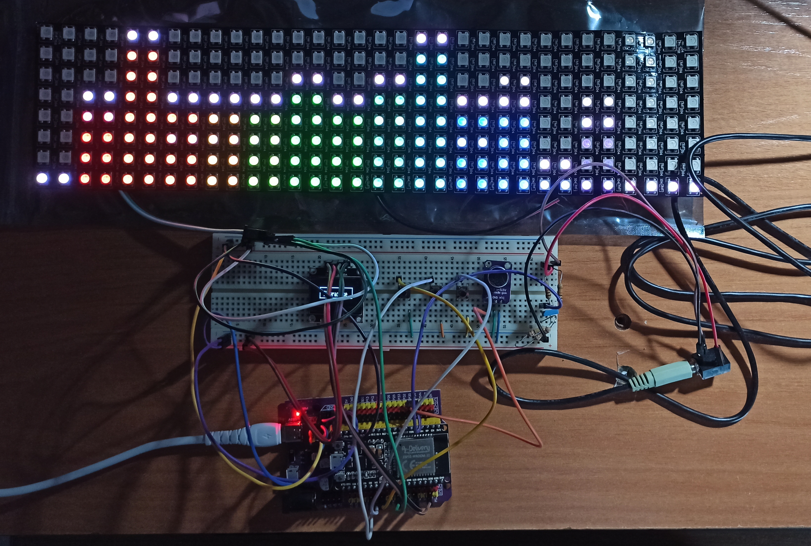
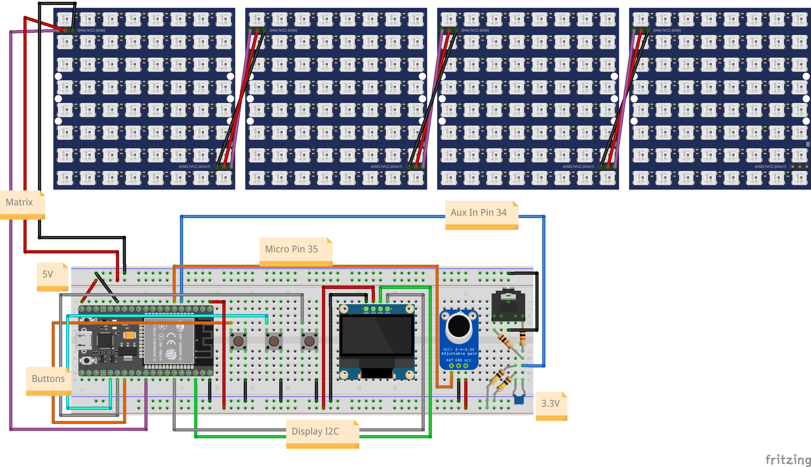

# Vumeter-ESP32-FFT
Spectrum Analyzer and Vumeter with ESP32 and Fast Fourier Transform on an ESP32 and outputting to a 32 x 8 FastLED matrix. The code is modified from [this s-marley's project](https://github.com/s-marley/ESP32_FFT_VU).

This project has been developed for an assignment at the [University of Cordoba, Spain](https://www.uco.es/).

## Results
The project is not finished nor is it visually pretty, as all the wires are exposed and not in any box.

## Setting up the circuit
The changes I have made with respect to the s-marley project have been to join the two circuits, separate the functions of the buttons and add the display.
If you have any doubts about why the resistors or the capacitor are connected in this way, you can see the explanation in his project.

The connection I have made has been:

As can be seen, the location of the components the final project with respect to the diagram is not the same but the connection is the same. Also, I have used a 32 x 8 LED matrix but the diagram design program did not have such that matrix, so I had to use 4 of 8 x 8 LEDs.

## Controls
The matrix is controlled from three buttons. The functions are:
* Left button
    - Single press: Change audio input
* Center button
    - Single press: Change pattern
    - Long press: auto-change pattern on
* Right button
    - Single press: Change brightness
    - Long press: Power off LEDs (brightness = 0)
